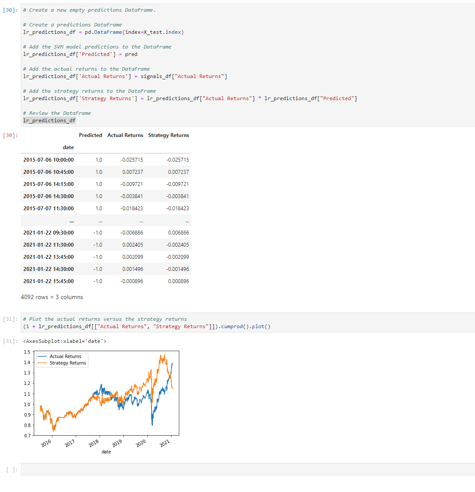

# module_14_challenge

The module 14 challenge for fintech course

The Jupyter Lab file follows along as an exercise to practice using logistical regression on algorithm trading pattern.

---

## Technologies

The sheet requires Pandas for analyzing data frames in jupyter labs.
It requires Jupyter Labs for a user interface.
It requires Path from pathlib to help read .csv files.
Requires sklearn.

---

## Installation Guide

Other than Python 3.7, the sklearn packages are required, Jupyter Labs runs in a browser, including Chrome.  Launch the file by navigating to the directory of the file through a CLI and then running Jupyter labs, with "jupyter lab".

sklearn can be installed form the CLI with the following:

conda install -c conda-forge imbalanced-learn

---

## Usage

The worksheet runs through a scenario and teaches the user to use tensorflow and build/optimize neural networks.

---

## Contributors

Michael Canavan

---

## License

The content of the course is owned and managed by UC Berkeley Fintech Bootcamp.

## Evaluation Report

The Logistic Regression model behaves much different than the original SVM model.  The new model creates a model that becomes substantially divergent between actual returns and model returns.  This can work both for and against the results.  The LR strategy has substantially different recall values than the original model.  With recall as recall = TPs / (TPs + FNs), the model seems worse at detecting when to stay in, and better when to get out.  this is not a problem with the algorithm for hte test data, until the very end when an incorrect sell signal ruins most of the models gains.

